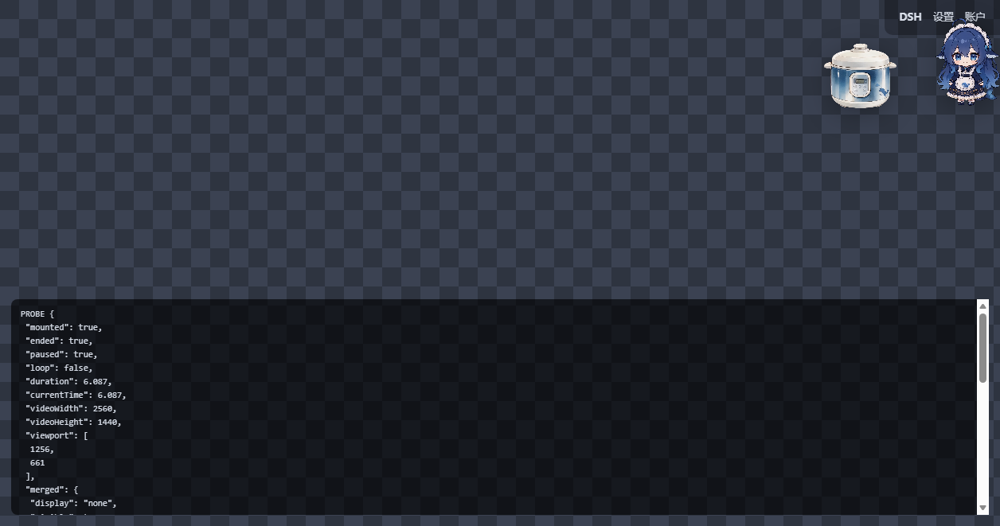
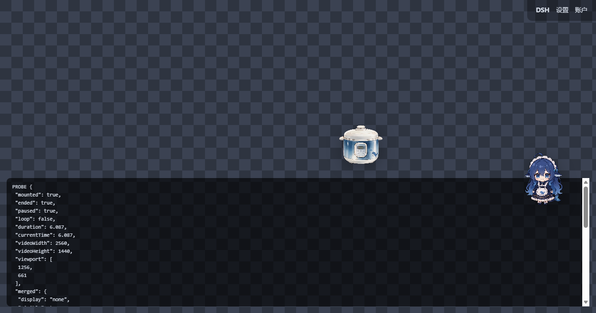

# dsh-corner-anim (A former name)🎬

**中文** | [English](#english)

DSH（DeepSeek Harness）右上角的透明动画挂件。开场动画随 DSH 打开自动播放一次、
停在最后一帧，然后**就地拆成「左电饭煲 / 右小女孩」**两块各自可拖的部分；
此后小女孩按节拍轮播待机/动作两段动画，并与「发送消息」联动、支持按压 Q 弹、
掉盆、拖动动画与电饭煲的两种随机开盖动画。

不新开窗口、不装第二套运行时、不占用额外端口 —— 一个纯 DSH 插件：
宿主半区注入客户端脚本，客户端只碰自己那棵 DOM 子树。

| 播完原地拆成两块（控件在小女孩一侧） | 两块各自拖开 |
| --- | --- |
|  |  |

```text
┌────────────────────────────────────────────────────────┐
│  DSH                          ┌──────┐  ↻ ⏸ ⇄1× ▾ ✕   │ ← 控件在小女孩一侧
│                               │ 小女孩│ ┌──────────────┐│
│  ┌──────┐        ┌──────┐     │      │ │ 显示大小 340px││ ← ▾ 展开的设置面板
│  │电饭煲│        │      │     └──────┘ │ 动画间隔 1×  ││
│  └──────┘        └──────┘        ↑ 两块各自可拖 └──────────────┘│
│  打开 DSH → 自动播放 → 停在最后一帧 → 就地拆成两块                │
│  → 待机每 5s、动作每 15s 轮流出画（同一时刻只一段，停在各自末帧）  │
└────────────────────────────────────────────────────────┘
```

---

## 目录 / Contents

| 中文 | English |
| --- | --- |
| [它做什么](#它做什么) | [What it does](#what-it-does) |
| [安装](#安装) | [Installation](#installation) |
| [使用](#使用) | [Usage](#usage) |
| [配置](#配置) | [Configuration](#configuration) |
| [调试入口](#调试入口) | [Debug API](#debug-api) |
| [和「发送消息」联动](#和发送消息联动) | [Send-message hook](#send-message-hook) |
| [实现说明](#实现说明) | [Implementation notes](#implementation-notes) |
| [素材](#素材) | [Assets](#assets) |
| [开发与测试](#开发与测试) | [Development](#development) |
| [排障](#排障) | [Troubleshooting](#troubleshooting) |

---

## 它做什么

| 行为 | 说明 |
| --- | --- |
| **打开就播放，停在最后一帧** | 客户端脚本随 DSH 页面加载，`<video>` 自带 `autoplay`（且 `muted`，不会被自动播放策略拦下）。**不设 `loop`** —— `ended` 之后画面就停在最后一帧，不淡出、不移除。 |
| **播完拆成两块** | 按最后一帧的 alpha 自动找两个主体之间的透明缝隙，把**电饭煲**和**小女孩**各裁成一块、各自可拖。电饭煲留在帧内原位；小女孩贴住窗口右边缘且整块完整可见（贴边间隙按动画层的实际溢出现算，不写死）。 |
| **两条节拍轮播** | 待机动画每 5 秒、动作动画每 15 秒各起播一次（基准可配），**同一时刻只有一段画面**：撞车动作优先、正在播不打断、错过的拍跳过；每段播完停在自己的末帧。间隔倍率可在控制条/面板调（0.25×~4×，记忆在 localStorage）。 |
| **「发送消息」联动** | 点发送（或输入框回车）→ 小女孩演一段（独占画面）→ 演完按钮搬到电饭煲上方、显示蓝色文案 + 计时器；**一轮对话完整结束**（宿主 `turn/end` 信号，见下文）→ 电饭煲原位播开盖动画（带声）、收掉文案与计时器；点击停在末帧的开盖画面 → 整条联动复位回拆分态。 |
| **点击 Q 弹** | 拆开后的两块按住即被压扁（`scaleY .88 / scaleX 1.05`，支点在底部中线）—— 被拉伸的是**按下那一刻的那一帧**（先暂停、再拍快照、再压扁）；松开带回弹地弹回，并**从暂停处继续播放**。拖动与按压是同一手势的两面（位移超过 3px 即成拖动）。 |
| **按压音效** | 每次按压出一声**现场合成**的短促"软弹"（三角波滑音 + 指数衰减，约 0.17s）；按压**电饭煲**另有 **7%** 概率改响随包 `pipe.mp3`（"钢管"，音量减半）。两者共用**内置 CD**（上一个音没播完不出声 + 150ms 防抖）—— 连点永不叠音。 |
| **掉盆** | 按压**小女孩**时 **10%** 概率从天而降一个钢盆扣在她头上（盆沿碰到头顶响一声「钢盆」）。可以一直往上摞（带随机偏移与倾角）、拖她时盆跟着走、拖到一旁就能摘掉。 |
| **拖动动画** | 拖**小女孩**时循环播放 `drag.webm`（"被拎起来"那一段），**松手立刻切回**她原来的画面；真越过 3px 拖动阈值才起播，拖动期间头上的盆自动让位。 |
| **电饭煲的两种随机动画** | 点击电饭煲先掷两个**互斥**的骰子：**20%** 播动画1「开盖 · 空锅」（带声，播完**倒放**回原样）；**10%** 播动画2「开盖 · 米饭热气」（带声）—— 小女孩同时演一段钢盆扣头、电饭煲在 5 秒内沿直线追过去，**逐帧判定矩形相交**即接触、双方立刻复位。都没中（默认 70%）才走点击 Q 弹 + 按压音效。 |
| **不被拖丢 / 不挡操作** | 每块至少保留 56px 在视口内，改窗口大小自动重新夹紧；宿主节点尺寸等于可见内容本身，除挂件区域外不拦截任何指针事件。 |

## 安装

### 1. 从本地目录安装（开发 / 本仓库）

```powershell
dsh plugin --profile desktop add link:<本目录的绝对路径>
```

`web` profile 同理，把 `desktop` 换成 `web`。发布后的安装命令：

```powershell
dsh plugin --profile desktop add dsh-corner-anim
```

### 2. 完全退出并重启 DSH

**桌面端（Electron 壳）必须重启 DSH**：注入表在宿主启动时一次性收集，
装完不重启就只有宿主半区活着、客户端半区永远不会被加载。
浏览器形态刷新页面即可。

### 3. 确认

打开 <http://127.0.0.1:19387/dsh-corner-anim/status>，正常应返回：

```json
{
  "plugin": "dsh-corner-anim",
  "version": "0.10.3",
  "ok": true,
  "turnSeq": 0,
  "assets": { "widget": { "bytes": 172000 }, "media": { "bytes": 6438836 }, "…": {} }
}
```

`ok: true` 说明路由与素材都就位了（**十二份素材一份都不能少**）；
`version` 应当是你刚装上的那一版 —— 安装后这里还显示旧版本号，说明 DSH 没重启。

## 使用

悬浮在挂件上会出现五个小按钮：

| 按钮 | 作用 |
| --- | --- |
| **↻ 重播** | 先复位发送联动，再把两块合回整体、从头播一遍；播完重新拆开并继续排期。 |
| **⏸ / ▶ 排期** | 暂停 / 继续整条节拍。暂停只让节拍停摆、画面**原样冻住**（绝不露出下层定格帧）；继续从当下重新计时。运行时按钮点亮成蓝色。 |
| **⇄1× 间隔** | 动画间隔档位：0.5× → 1× → 2× → 4× 循环。倍率是乘法，两条节拍同比缩放。 |
| **▾ / ▴ 折叠** | 展开设置面板（显示大小滑杆 + 小/中/大预设 + 重置；动画间隔滑杆 + 档位）。面板展开时按钮常显。 |
| **✕ 关闭** | 本次运行内移除（刷新页面后会回来）。 |

拖动：合并态整块拖、拆分后两块各自拖；位置记在 localStorage
（`dsh-corner-anim:pos:v1` 与 `:pos:cooker|girl:v1`）。
设置面板的尺寸 / 展开状态 / 间隔倍率也分别记忆（`:size:v1` / `:panel:v1` / `:speed:v1`）。

## 配置

全部可选。改 `~/.dsh/profiles/<profile>/cordis.patch.yml`（与本包自带的
[cordis.patch.yml](cordis.patch.yml) 同一格式）：

```yaml
- insert:
    - id: dsh-corner-anim
      name: dsh-corner-anim
      config:
        enabled: true            # false = 完全不加载
        corner: top-right        # top-right | top-left | bottom-right | bottom-left
        width: 220               # 初始显示宽度（px），也是面板「重置」的目标值
        minWidth: 80             # 面板滑杆下限（px）
        maxWidth: 600            # 面板滑杆上限（px）
        offsetX: 20              # 距视口左右边缘的间距（px）
        offsetY: 20              # 距视口上下边缘的间距（px）
        opacity: 1               # 0.05 ~ 1
        draggable: true          # 是否允许拖动
        showControls: true       # 是否显示控制条与设置面板
        rememberPosition: true   # 拖动后是否记住位置
        split: true              # 播完后是否拆成两块
        splitAutoDetect: true    # 是否按最后一帧的 alpha 自动找分割线
        splitRatio: 0.5          # 自动探测不可用时的兜底分割比例（0.05 ~ 0.95）
        idle: true               # 待机动画 assets/idle.webm
        idleEvery: 5000          # 待机动画基准间隔（ms；实际 = 基准 × 倍率）
        idleScale: 1             # 待机动画相对小女孩那块的缩放（0.1 ~ 10）
        act: true                # 动作动画 assets/act.webm
        actEvery: 15000          # 动作动画基准间隔（ms）
        actScale: 1              # 动作动画相对小女孩那块的缩放
        sendHook: true           # 是否启用「发送消息」联动
        sendSelector: ''         # 指定发送按钮的 CSS 选择器；留空 = 按语义找
        sendGirlScale: 1         # 点发送后那段动画的缩放（0.1 ~ 10）
        sendLidScale: 1          # 开盖动画的缩放（0.1 ~ 10）
        sendLabel: '肥鱼已经煮饭：'  # 计时器上方的文案
        sendLabelColor: '#3b82f6'   # 该文案的颜色（只接受字面颜色，防注入）
        sendLidAudio: true       # 开盖动画是否放声
        clickSquish: true        # 点击 Q 弹（false = 按住不再压扁）
        pressSound: true         # 按压音效总开关
        pressVolume: 0.6         # 音效音量 0 ~ 1
        pipeChance: 0.07         # 按压电饭煲改响「钢管」的概率（0 = 从不）
        pipeVolume: 0.5          # 「钢管」相对 pressVolume 的倍率
        potChance: 0.1           # 按压小女孩掉盆的概率（0 = 关掉）
        randomAnims: true        # 电饭煲两种随机动画的总开关
        randomAChance: 0.2       # 动画1「开盖 · 空锅」的概率
        randomBChance: 0.1       # 动画2「开盖 · 米饭热气」的概率
        randomFlightMs: 5000     # 动画2 里电饭煲"追到她"的上限时长（ms）
        randomContactScale: 0.95 # 动画2 里她那段相对她那块的高度比例
        randomReverseMs: 1200    # 动画1 倒放的时长（ms）
        randomRiceScale: 1       # 动画2 素材的内容倍率
        randomEmptyScale: 1      # 动画1 素材的内容倍率
        dragAnim: true           # 拖小女孩时是否播拖动动画
        dragScale: 1             # 拖动动画相对她那块的高度倍率
        dragRate: 1              # 拖动动画的播放倍速（0.25 ~ 4）
```

优先级与生效条件的要点：

- `corner` / `offsetX` / `offsetY` 只在**没有记忆位置**时生效；
  想回到配置角落：`localStorage.removeItem('dsh-corner-anim:pos:v1')`。
- 面板里调过的**尺寸优先于 `width`**（始终夹在 `[minWidth, maxWidth]` 内）；
  **间隔倍率优先于基准值**（夹在 [0.25, 4]，乘法作用）。点面板「重置」或清对应
  localStorage 键可回到配置值。
- `idle: false` / `act: false` 各自关掉一段；两段都关 = 播完只留两张定格图。
  `split: false` 时没有「小女孩那块」，两段动画与发送联动的小女孩环节都不会出现。
- `clickSquish` / `pressSound` / `pipeChance` / `pipeVolume` / `potChance` /
  `randomAnims` / `dragAnim` 都是配置文件级别的开关（面板里没有对应控件）。
- 配置值做了容错：字符串数字会转数字、越界会夹回、`minWidth`/`maxWidth`
  写反自动纠正、未知字段忽略 —— 写错任何一项都不会导致插件不加载。

## 调试入口

控制台里可用的只读探针与手动触发器（自检脚本全靠它们）：

```js
window.__dshcaSend.findButton()   // 现在认定哪颗是发送按钮（null = 没找到）
window.__dshcaSend.probe()        // 观察器内部状态（基线、正文长度、思索状态…）
window.__dshcaSend.debug()        // 每次判断的依据与时间戳
window.__dshcaSend.simulate()     // 手动把事件 1 + 事件 2 各走一遍
window.__dshcaSend.output()       // 只触发事件 2（开盖那一段）
window.__dshcaSend.reset()        // 复位到初始布局

window.__dshcaPress.probe()       // CD 还剩多久、素材就绪没有、上次响的是哪种
window.__dshcaPress.play('pipe')  // 手动试听（不受 CD 限制）
window.__dshcaPress.reset()

window.__dshcaPots.probe()        // 头上有几个盆、骰子概率、图片就绪没有
window.__dshcaPots.drop()         // 手动掉一个（不受骰子限制）
window.__dshcaPots.clear()        // 全摘掉

window.__dshcaRandom.probe()      // 谁在演、锅被挪了多远、两条概率
window.__dshcaRandom.play('lid1') // 手动演动画1（不用等那 20%）
window.__dshcaRandom.play('lid2') // 手动演动画2（含"飞过去 + 接触"）
window.__dshcaRandom.drag(true)   // 手动起拖动动画（false = 收）
window.__dshcaRandom.stop()       // 立刻收工
window.__dshcaRandom.debug()      // 事件账本 + 最近 40 次显隐判定
```

`play()` / `drop()` / `simulate()` 这些入口**不受概率限制** ——
随机事件靠手点复现不了，验证就靠它们。

## 和「发送消息」联动

页面脚本读不到 React 状态，所以侦测全部靠观察 DOM，判据刻意与 class 名无关：

| 时机 | 判据 | 动作 |
| --- | --- | --- |
| 点了「发送消息」 | 发送按钮被点（`aria-label` 精确匹配"发送消息"优先，文案语义兜底），或在输入框回车（且页面确实存在可用的发送按钮） | 播 `girl.webm` |
| 她演完 | `<video>` 的 `ended`（另有 `loadedmetadata` 时长兜底） | 按钮搬到电饭煲上方、隐藏小女孩、显示文案 + 起步计时器 |
| 一轮对话完整结束 | **主判据**：宿主监听 `session/event` 的 `turn/end` 并累加 `seq`，客户端每秒轮询 `/dsh-corner-anim/turn.json`，`seq` 变大即触发 —— 与 whale 挂件弹「本次消费金额」同一时刻；**兜底**：信号连续 3 次不可达时退回旧的"正文增长"探测（只看回答正文容器、排除推理行，深度思索未结束一律按住） | 电饭煲原位播 `lid.webm`（带声），播完定格并收掉文案与计时器 |
| 又发了下一条 | 同第一行（1.5 秒去抖，一轮收尾后重新武装） | 整套重置重来 |

为什么用 turn/end 当主判据：正文开始增长只说明"开始写答案"，之后还有工具调用、
多步推理；turn/end 才是"这一轮真的结束了"。信号不可用（旧宿主）时兜底路径
保证开盖不会永远不播。

按钮找不准时配 `sendSelector: '#你的按钮'`；想整体关掉用 `sendHook: false`。

## 实现说明

### 两条注入通道

DSH 有 Web（浏览器）与桌面（Electron 壳）两种形态，注入方式不同：

| 形态 | 通道 |
| --- | --- |
| Web | `webServer.tapIndex(html => …)`：对每个 `index.html` 响应追加 `<script defer src=…>`。 |
| 桌面 | `webserver/index-inject` 结构化行：桌面壳的 index.html 由安装包静态 dist 直出，永远不经过 `renderIndex()`，必须推**内联 `script` 行**（自己建 `<script src>` 并吞掉 onerror）。推 `script-src` 行会在路由缺失时 reject 掉 `__DSH_BOOT_READY__`，DSH 直接起不来。 |

### 屏幕上有且仅有一段画面

整个客户端只有**一个判据**：`shownKind`（当前该出画的是哪一路）。所有显隐变化
都收口在 `showOnly(kind)`：它把该路推到 DOM 末尾并显示（同层绝对定位下 DOM 顺序
就是堆叠顺序），其余各路 `visibility:hidden` 且 `pause()`。隐藏用 `visibility`
而不是 `display`（盒子还在、尺寸能量到，切回瞬时）。暂停不改画面、继续保留画面
只放掉排期的位；素材坏掉的那一路自己定格，绝不"换一段顶上"。

### 拆分是怎么找分割线的

把最后一帧缩到 256 宽的小画布读 alpha，算出每列的覆盖量；只认**左右都不贴画面
边缘**、两侧各自还有 ≥15% 内容的空列区间（贴边的空白是留白不是缝隙），取最长
一条的中点当分割线；左右两块再各自收紧到自己内容的包围盒。跨源素材读不到像素时
退回 `splitRatio` 按比例切。实测 2K 素材拆分为：电饭煲 `[220, 390, 1060, 960]`、
小女孩 `[1340, 40, 900, 1280]`（源像素），中间 60px 透明缝两块都不占。

### 动画是怎么摆正的

各素材画幅与人像占比差异极大（内容只占画幅 36%~100% 不等），所以**不能**
把 `<video>` 铺满那一块。做法是按**内容包围盒**对齐：起播前把素材画进 256 宽的
小画布读一次 alpha（阈值 alpha > 24，免得抗锯齿边缘把框撑胖），量出内容框；
然后内容**水平居中、底边对齐**、内容高（锅那段是内容宽）贴齐目标块 × 手动旋钮。
量不到像素时退回"整幅等比"，用对应的 `*Scale` 手动微调。

### 动画2 的"接触"是逐帧判定的

移动量**一次算清**：在"原位 → 她的位置"直线上按比例采样 160 个点（smoothstep
分布），用她那块的矩形求每个点的重叠率，取最大者当终点（不越过接触点）；
然后逐帧（`requestAnimationFrame`）推进，哪一帧两块矩形相交过半（≥50% 面积比）
即算接触 —— 电饭煲立刻归位、她那段收工、两边回到各自的定格图。5 秒没碰到
也算收工，绝不留一口飞在半路的锅。位置走 `transform`（CSS 变量
`--dshca-fly-*`），**绝不改 `left`/`top`** —— 拖动几何与贴边判据读的就是它们。

### 叠放层级（掉盆）

```
z=2  控制条 / 设置面板     ← 永远能点到
z=1  #dshca-pots（盆）     ← 只有盆本体接指针事件
z=0  画面层 + Q 弹快照     ← 快照里没有盆（独立节点）
```

## 素材

随包素材的实际参数（ffprobe 与无头 Chromium 实测）：

| 文件 | 用途 | 规格 | 音轨 |
| --- | --- | --- | --- |
| `anim.webm` | 开场动画（播完拆两块） | VP9 2560×1440，6.087s | 无（挂件静音） |
| `idle.webm` | 待机动画（每 5s） | VP9 1440×1920，5.048s | 无（已抽掉） |
| `act.webm` | 动作动画（每 15s） | VP8 1440×1916，5.003s | 无 |
| `girl.webm` | 点发送后小女孩那段 | VP9 1920×1080，5.042s | 无 |
| `lid.webm` | 开盖动画（发送联动） | VP9 2560×1440，5.065s | **有（特意保留）** |
| `drag.webm` | 拖动动画（循环） | VP9 1112×834，5.542s | 无 |
| `lid-empty.webm` | 动画1「开盖 · 空锅」 | VP9 960×960，5.065s | **有** |
| `lid-rice.webm` | 动画2「开盖 · 米饭热气」 | VP9 960×960，5.065s | **有** |
| `girl-basin.webm` | 动画2 里小女孩那段 | VP9 1280×720，5.042s | 无 |
| `pipe.mp3` | 「钢管」彩蛋音（已裁首部静音） | 2.42s / 39168 B | — |
| `basin.png` | 钢盆（透明 PNG，已裁水印） | 1006×577 | — |
| `basin.mp3` | 盆砸到头上的音效 | 1.05s | — |

全部素材都是带 alpha 通道的 WebM（`AlphaMode`）/ 透明 PNG。换素材注意：

- **别用重编码换 WebM**：VP9 的 alpha 存在独立的 BlockAdditions 里，
  重编码很容易压没；用 `-c copy` 只搬字节，alpha 原封不动：

  ```powershell
  ffmpeg -i 你的素材.webm -map 0:v:0 -c copy -an dsh-corner-anim/assets/act.webm
  ```

- 音效**开头不能留静音**（客户端拿到就播）；没有 ffmpeg 时可用
  [tools/audio-trim.mjs](tools/audio-trim.mjs) 按 MP3 帧边界无损裁掉：

  ```powershell
  node tools/audio-trim.mjs probe 新的音效.mp3
  node tools/audio-trim.mjs trim  新的音效.mp3 assets/pipe.mp3
  ```

- 换图/换动画**不用改任何配置**：分割线与各素材的内容包围盒都是运行时
  从 alpha 现算的，只要新素材的主体之间有竖直透明缝隙就能拆。

## 开发与测试

```text
lib/index.js        宿主半区：注入 + 素材路由 + turn 信号 + 配置归一化
assets/widget.js    客户端半区：全部页面行为（经典脚本，无构建步骤）
test/               双层自检（见下）
tools/              素材小工具（音效裁静音 / 头顶比例探测）+ 打包脚本
docs/dev-checks/    真实浏览器验证的截图留痕
cordis.patch.yml    DSH bundle 挂载声明 + 全量配置注释
```

打包发布用 `python tools/build_tgz.py`（产物在 `dist/`，即 `dsh plugin add`
直接吃的 tgz）。

验证分两层，都是可复跑的（Node ≥ 20）：

```powershell
node test/widget-harness.mjs   # DOM 桩：状态机、排期不变量、Q 弹、音效 CD、掉盆、随机动画
                               # 与发送联动的全流程（turn 信号 + legacy 兜底两条路都验）
node test/host-harness.mjs     # 真实 HTTP：路由、Range 语义、素材魔数/音轨、turn.json、配置归一化
```

`npm test` 等价于跑这两个。另有三条需要真实浏览器的脚本
（`test/preview-server.mjs` + `test/cdp-*.mjs`，截图落 `docs/dev-checks/`），
用于验证过渡动画、计算样式与真实布局。

## 排障

| 症状 | 先看什么 |
| --- | --- |
| 装上了但没反应 | <http://127.0.0.1:19387/dsh-corner-anim/status>：`ok` 必须为 `true`，`version` 必须是新版本（旧号 = DSH 没重启）。 |
| 桌面端不出现 | 必须**完全退出并重启** DSH（注入表启动时一次性收集）。 |
| 看不到动画 / 听不到音效 | status 里对应素材的 `bytes` 是否为 `null`（少文件）；`pipe.mp3` 开头是否被塞了静音。 |
| 开盖动画不播 | 控制台 `__dshcaSend.probe()`：`armed` / `turnSeq` / `reasoningRunning`；旧宿主收不到 turn 信号时会走正文增长兜底，`debug()` 里有每次判断的依据。 |
| 点锅什么都没出 | 默认有 70% 概率什么都不触发（那是 Q 弹的份额）；用 `__dshcaRandom.play('lid1')` 跳过骰子直接验。 |

## 卸载

```powershell
dsh plugin --profile desktop remove dsh-corner-anim
```

然后重启 DSH。

## 更新日志

各版本的变更与修复细节见 [docs/CHANGELOG.md](docs/CHANGELOG.md)。

## License

代码以 [MIT](LICENSE) 发布；`assets/` 下媒体素材的来源与授权另见
[docs/ASSETS.md](docs/ASSETS.md)。

---

<a id="english"></a>

# dsh-corner-anim 🎬 (English)

A transparent animation widget for the top-right corner of DSH (DeepSeek
Harness). The opener plays once when DSH starts and **holds its last frame**,
then splits **in place into "rice cooker (left) / girl (right)"** — two
independently draggable parts. Afterwards the girl runs a two-clip schedule
(idle every 5s, action every 15s), and the widget reacts to sending messages,
pressing, dragging and clicking with a handful of built-in animations.

No extra window, no second runtime, no extra port — a pure DSH plugin: the
host half injects the client script; the client script only touches its own
DOM subtree.

## What it does

| Behaviour | Details |
| --- | --- |
| **Play once, hold last frame** | The script loads with the page; the `<video>` autoplays (muted, so autoplay policies never block it). **`loop` is never set** — on `ended` the engine keeps showing the final frame; no fade-out, no removal. |
| **Split into two parts** | The last frame's alpha channel is scanned for the transparent gap between the two subjects; each part becomes an independently draggable `<canvas>` crop. The cooker stays where the frame had it; the girl hugs the window border, fully visible (the side gap is computed from the animation layers' real overflow, not hardcoded). |
| **Two-clip schedule** | The idle clip starts every 5s, the action clip every 15s (configurable bases). **Exactly one picture on screen at any time**: collisions go to the action clip, a playing clip is never interrupted, missed ticks are skipped; every clip parks on its own last frame. The interval multiplier (0.25×–4×) is adjustable and remembered. |
| **Send-message hook** | Clicking send (or Enter in the composer) → the girl plays a run-out clip (sole owner of the screen) → the five buttons move above the cooker, a blue label + timer appear below it; **when the whole turn has finished** (host `turn/end` signal, see below) → the open-lid clip plays in the cooker's own place (with sound), the label/timer are cleared; clicking the frozen lid frame → the whole flow resets back to the split state. |
| **Click squish** | Pressing either part squashes the frame that was on screen at that instant (`scaleY .88 / scaleX 1.05`, pivot at the bottom center — pause first, then snapshot, then squash). Releasing bounces back with an overshoot easing and **resumes playback** from where it paused. Press and drag are two faces of one gesture (movement beyond 3px turns it into a drag). |
| **Press sound** | Every press plays a short synthesized "soft pop" (triangle slide + exponential decay, ~0.17s). Pressing the **cooker** has a **7%** chance to play the bundled `pipe.mp3` easter egg instead (half volume). Both share a built-in CD (previous sound still playing → silent, plus a 150ms debounce) — rapid clicks never stack sounds. |
| **Basin drop** | Pressing the **girl** has a **10%** chance to drop a steel basin on her head (a clang when it lands). Basins stack with random jitter, follow her while dragging, and can be plucked off by dragging them away. |
| **Drag animation** | Dragging the girl plays `drag.webm` in a loop ("being picked up"); releasing switches straight back to her own frame. It only starts after the 3px threshold is truly crossed, and basins step aside while it plays. |
| **Two random cooker animations** | Clicking the cooker rolls two **mutually exclusive** dice: **20%** animation 1 "open lid · empty pot" (with sound, then **plays backwards** to restore itself); **10%** animation 2 "open lid · rice steam" (with sound) — the girl performs a basin-on-head bit while the cooker flies to her in ≤5s, contact decided **per frame by real rectangle intersection**; both reset instantly on contact. The remaining 70% falls through to click-squish + press sound. |
| **Never lost, never in the way** | Each part keeps ≥56px inside the viewport and re-clamps on resize; the host element is exactly the visible content — no pointer events outside the widget area. |

## Installation

```powershell
# from a local folder (development)
dsh plugin --profile desktop add link:<absolute path to this folder>

# once published
dsh plugin --profile desktop add dsh-corner-anim
```

For the `web` profile replace `desktop` with `web`.

**Fully quit and restart DSH on the desktop**: the injection table is
collected once at host startup — without a restart the host half loads but the
client half never does. In the browser form, reloading the page is enough.

Verify: open <http://127.0.0.1:19387/dsh-corner-anim/status> and check
`"ok": true` and that `version` matches the build you just installed
(an old version number means DSH was not restarted).

## Usage

Hovering the widget reveals five buttons: **↻ replay** (reset the send flow,
merge, play again), **⏸/▶ schedule** (pause/resume — pausing freezes the
picture exactly as-is), **⇄1× interval** (0.5×→1×→2×→4×), **▾/▴ panel**
(display-size slider + presets + reset; interval slider + presets), and
**✕ close** (removes for this run).

Dragging works on the merged widget and on each part; positions persist in
`localStorage` (`dsh-corner-anim:pos:v1`, `:pos:cooker|girl:v1`), as do the
panel size / open state / interval multiplier (`:size:v1`, `:panel:v1`,
`:speed:v1`).

## Configuration

All options are optional. Edit `~/.dsh/profiles/<profile>/cordis.patch.yml`
(same shape as the bundled [cordis.patch.yml](cordis.patch.yml)):

```yaml
- insert:
    - id: dsh-corner-anim
      name: dsh-corner-anim
      config:
        enabled: true            # false = do not load at all
        corner: top-right        # top-right | top-left | bottom-right | bottom-left
        width: 220               # initial display width (px); also the panel "reset" target
        minWidth: 80             # panel slider lower bound (px)
        maxWidth: 600            # panel slider upper bound (px)
        offsetX: 20              # gap to the viewport edges (px)
        offsetY: 20
        opacity: 1               # 0.05 ~ 1
        draggable: true
        showControls: true       # control bar + settings panel
        rememberPosition: true
        split: true              # split into two parts after the opener
        splitAutoDetect: true    # detect the gap from the last frame's alpha
        splitRatio: 0.5          # fallback ratio when detection is unavailable
        idle: true               # assets/idle.webm
        idleEvery: 5000          # base period (ms); actual = base × multiplier
        idleScale: 1
        act: true                # assets/act.webm
        actEvery: 15000
        actScale: 1
        sendHook: true           # the send-message flow
        sendSelector: ''         # explicit send-button selector; empty = semantic detect
        sendGirlScale: 1
        sendLidScale: 1
        sendLabel: '肥鱼已经煮饭：'
        sendLabelColor: '#3b82f6'   # literal colors only (injection-safe)
        sendLidAudio: true
        clickSquish: true
        pressSound: true
        pressVolume: 0.6
        pipeChance: 0.07
        pipeVolume: 0.5
        potChance: 0.1
        randomAnims: true
        randomAChance: 0.2
        randomBChance: 0.1
        randomFlightMs: 5000
        randomContactScale: 0.95
        randomReverseMs: 1200
        randomRiceScale: 1
        randomEmptyScale: 1
        dragAnim: true
        dragScale: 1
        dragRate: 1
```

Notes:

- `corner` / `offsetX` / `offsetY` only apply while **no position is
  remembered**; clear `dsh-corner-anim:pos:v1` to return to the configured corner.
- Panel-adjusted size/interval override `width` / `idleEvery` / `actEvery`
  (always clamped); the panel's reset button (or deleting the storage keys)
  restores the configured values.
- The file-level switches (`clickSquish`, `pressSound`, `pipeChance`,
  `pipeVolume`, `potChance`, `randomAnims`, `dragAnim`, …) have no panel controls.
- Values are fault-tolerant: numeric strings coerce, out-of-range values clamp,
  a reversed `minWidth`/`maxWidth` pair is corrected, unknown keys are dropped —
  a bad config can never keep the plugin from loading.

## Debug API

Read-only probes and manual triggers, used by the self-checks:

```js
window.__dshcaSend.findButton()   // which element is the send button right now
window.__dshcaSend.probe()        // watcher internals (baseline, text length, reasoning state…)
window.__dshcaSend.debug()        // every decision with timestamps
window.__dshcaSend.simulate()     // drive event 1 + event 2 by hand
window.__dshcaSend.output()       // fire event 2 only (the lid clip)
window.__dshcaSend.reset()

window.__dshcaPress.probe() / .play('pipe'|'synth') / .reset()
window.__dshcaPots.probe() / .drop() / .clear()
window.__dshcaRandom.probe() / .play('lid1'|'lid2') / .drag(true|false) / .stop() / .debug()
```

These entries are **not limited by the dice** — random events cannot be
reproduced by clicking around, so verification goes through them.

## Send-message hook

A page script cannot read React state, so everything is detected from the DOM
with deliberately class-name-independent rules:

| Moment | Rule | Action |
| --- | --- | --- |
| Send clicked | The clicked element is the send button (`aria-label` exact match first, wording heuristics as fallback), or Enter in the composer while a usable send button exists | play `girl.webm` |
| Her clip ends | `ended` (plus a duration-based guard) | move the buttons above the cooker, hide her, show label + timer |
| The turn fully finished | **Primary**: the host counts `turn/end` events from `session/event`; the client polls `/dsh-corner-anim/turn.json` once a second and fires when `seq` grows — the same moment the whale widget shows the bill; **Fallback**: after 3 consecutive failed polls, the legacy "answer text grew" detector takes over (answer containers only, reasoning rows excluded, held while "深度思索" is running) | play `lid.webm` in the cooker's place (with sound), park on the last frame, clear label + timer |
| Next message | same as row 1 (1.5s debounce, re-armed after a turn settles) | full reset and start over |

Why the trigger changed: text growth only means "the answer started writing" —
tool calls and multi-step reasoning may follow. `turn/end` means the whole
turn is really over. When the signal is unavailable the fallback keeps the lid
from never playing.

Use `sendSelector` if the button cannot be identified; `sendHook: false`
disables the whole flow.

## Implementation notes

### Two injection channels

| Form | Channel |
| --- | --- |
| Web | `webServer.tapIndex(...)` appends `<script defer src=…>` to every `index.html` response. |
| Desktop | The desktop shell serves a static `index.html` (`dsh-app://app/`) that never passes through `renderIndex()`, so the plugin pushes an **inline `script` row** via `webserver/index-inject` (the row creates its own `<script src>` and swallows `onerror`). A `script-src` row would reject `__DSH_BOOT_READY__` and keep DSH from booting when the route is missing. |

### Exactly one picture on screen

The client keeps a single source of truth: `shownKind` — which clip should be
on screen. Every visibility change funnels through `showOnly(kind)`, which
moves that clip to the end of the DOM (stacking order = DOM order for absolutely
positioned siblings), shows it, and hides + pauses everything else with
`visibility` (boxes stay measurable, so switching back is instant). Pausing
never changes the picture; a broken asset freezes its own slot instead of being
replaced by another clip.

### How the split line is found

The last frame is drawn into a 256px-wide canvas, the alpha coverage per column
is measured, and only empty-column runs that do **not** touch the frame edge and
leave ≥15% content on both sides are candidates (edge margins are not gaps).
The longest run's midpoint becomes the split line; each side is then tightened
to its own content bounding box. Cross-origin (tainted) frames fall back to
`splitRatio`.

### How clips are laid out

Asset framing varies wildly (content occupies 36%–100% of the canvas), so a
`<video>` is never simply stretched over its part. Each clip measures its
**content bounding box** once (alpha > 24 on a 256px probe canvas), then the
content is placed **horizontally centered, bottom-aligned**, with its content
height (width for the cooker clips) fitted to the target part × a manual knob.
When pixels cannot be read, the layout falls back to full-frame scaling.

### Animation 2's contact is decided per frame

The travel is computed once: 160 samples along the straight line (smoothstep
distribution), each scored by rectangle overlap with the girl's part; the best
sample is the destination (never past the contact point). A
`requestAnimationFrame` loop then advances progress and the moment both
rectangles overlap by ≥50% of the smaller area, the cooker snaps home (the
`transform` + class are removed), her clip ends, and both sides return to their
frozen frames. If nothing touches within 5s, the flow still settles — a cooker
never stays stranded mid-flight. Movement uses `transform` (CSS variables
`--dshca-fly-*`), never `left`/`top`.

### Stacking order (basins)

```
z=2  control bar / panel   ← always clickable
z=1  #dshca-pots (basins)  ← only the basins themselves take pointer events
z=0  picture + squish snap ← snapshots contain no basins (separate nodes)
```

## Assets

Measured parameters of the bundled assets (ffprobe + headless Chromium):

| File | Purpose | Specs | Audio |
| --- | --- | --- | --- |
| `anim.webm` | opener (split afterwards) | VP9 2560×1440, 6.087s | none |
| `idle.webm` | idle clip (every 5s) | VP9 1440×1920, 5.048s | none (stripped) |
| `act.webm` | action clip (every 15s) | VP8 1440×1916, 5.003s | none |
| `girl.webm` | run-out clip after send | VP9 1920×1080, 5.042s | none |
| `lid.webm` | open-lid clip (send flow) | VP9 2560×1440, 5.065s | **kept on purpose** |
| `drag.webm` | drag animation (looped) | VP9 1112×834, 5.542s | none |
| `lid-empty.webm` | animation 1 "empty pot" | VP9 960×960, 5.065s | **kept** |
| `lid-rice.webm` | animation 2 "rice steam" | VP9 960×960, 5.065s | **kept** |
| `girl-basin.webm` | animation 2, her part | VP9 1280×720, 5.042s | none |
| `pipe.mp3` | "pipe" easter egg (silence trimmed) | 2.42s / 39168 B | — |
| `basin.png` | steel basin (transparent, watermark cropped) | 1006×577 | — |
| `basin.mp3` | basin clang | 1.05s | — |

All clips are alpha-enabled WebM (`AlphaMode`); the still is a transparent PNG.
When replacing assets:

- **Do not re-encode WebM**: VP9 alpha lives in separate `BlockAdditions`;
  use `-c copy` so the alpha structure is untouched:

  ```powershell
  ffmpeg -i your-clip.webm -map 0:v:0 -c copy -an dsh-corner-anim/assets/act.webm
  ```

- Sound effects must **not start with silence** (the client plays immediately).
  Without ffmpeg, [tools/audio-trim.mjs](tools/audio-trim.mjs) trims leading
  silence losslessly at MP3 frame boundaries.
- No config changes are needed after swapping assets: the split line and every
  content box are measured from the alpha at runtime.

## Development

```text
lib/index.js        host half: injection + asset routes + turn signal + config
assets/widget.js    client half: all page behaviour (classic script, no build step)
test/               two self-check layers (see below)
tools/              asset utilities (silence trimmer / head probe) + packaging script
docs/dev-checks/    screenshots from real-browser verifications
cordis.patch.yml    DSH bundle mount declaration + annotated config
```

To build the distributable plugin tarball (`dsh plugin add` input), run
`python tools/build_tgz.py` — the artifact lands in `dist/`.

Two reproducible check layers (Node ≥ 20):

```powershell
node test/widget-harness.mjs   # DOM stub: state machines, schedule invariants, squish,
                               # sound CD, basins, random animations, and both send-flow
                               # paths (turn signal + legacy fallback)
node test/host-harness.mjs     # real HTTP: routes, Range semantics, asset magic bytes /
                               # tracks, turn.json, config normalization
```

`npm test` runs both. Three additional scripts exercise a real browser
(`test/preview-server.mjs` + `test/cdp-*.mjs`; screenshots land in
`docs/dev-checks/`).

## Troubleshooting

| Symptom | Check first |
| --- | --- |
| Installed but nothing happens | <http://127.0.0.1:19387/dsh-corner-anim/status> — `ok` must be `true` and `version` must be the new build (an old number means DSH was not restarted). |
| Nothing on the desktop | Fully quit and restart DSH (the injection table is collected once at startup). |
| No animation / no sound | In the status JSON the asset's `bytes` must not be `null`; check `pipe.mp3` has no leading silence. |
| The lid never plays | Console `__dshcaSend.probe()`: `armed` / `turnSeq` / `reasoningRunning`; on old hosts the text-growth fallback takes over and `debug()` records every decision. |
| Clicking the cooker does nothing | By default 70% of clicks intentionally fall through to the squish; use `__dshcaRandom.play('lid1')` to verify without the dice. |

## Uninstall

```powershell
dsh plugin --profile desktop remove dsh-corner-anim
```

Then restart DSH.

## Changelog

Per-version notes and fixes: [docs/CHANGELOG.md](docs/CHANGELOG.md).

## License

The code is released under [MIT](LICENSE); for the provenance and licensing of
the bundled media in `assets/`, see [docs/ASSETS.md](docs/ASSETS.md).
